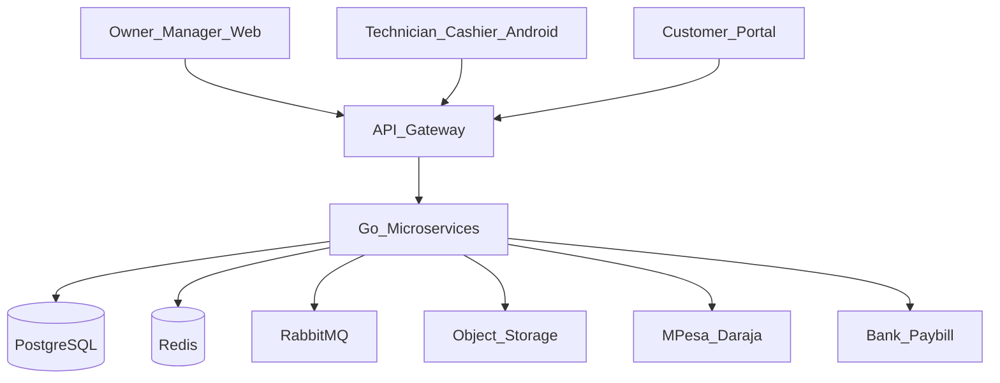

# Architecture Overview

## 1. Context

TechLane is a greenfield Go monorepo delivering repair-first operations with POS readiness and future e-commerce. Clients (ops web, Android, customer portal) talk to a shared backend via REST through an API gateway.

## 2. System context

## 3. Technology stack

| Layer | Choice | Rationale |
|-------|--------|-----------|
| Backend | Go microservices (monorepo) | Clear domains, hiring, performance |
| External API | REST + OpenAPI | Client generation for web/Android |
| Internal | gRPC only where justified | Inventory reserve hot paths |
| Async | RabbitMQ | Events, retries, DLQ |
| Cache / locks | Redis | Sessions, idempotency, rate limits |
| DB | PostgreSQL | Transactional SoT |
| Files | S3-compatible (R2) | Photos, receipts, invoices |
| Web ops | React + Vite + TypeScript | Ops SPA, TanStack ecosystem |
| Android | Kotlin + Jetpack Compose | Native offline-first quality |
| Deploy | Docker Compose (stage 1) | Avoid premature K8s |
| Observability | OTel, Prometheus, Grafana, JSON logs | Traces, metrics, logs |

## 4. Container view

| Container | Role |
|-----------|------|
| `apps/web-ops` | Authenticated operations dashboard |
| `apps/android` | Shop floor APK |
| `apps/web-portal` | Customer repair portal (later) |
| `apps/web-storefront` | Public commerce (phase 5+) |
| `services/api-gateway` | Auth edge, routing, rate limit, BFF |
| Domain services | Identity, repair, inventory-supplier, pos-sales, payments-cash, audit-risk, notification, worker |
| Infra | Postgres, Redis, RabbitMQ, object storage |

## 5. Key principles

1. **UI never owns business truth** — permissions, totals, stock, and prices validated in Go.
2. **Append-only financial and inventory ledgers** — corrections via reversals/movements.
3. **Database-per-service schemas** in one Postgres instance initially.
4. **`tenant_id` everywhere** — single-tenant deploy first, multi-business ready.
5. **One catalog, one inventory, one customer, one payment platform** — multiple selling channels.
6. **Sensitive actions online-only**; offline drafts via idempotent outbox.
7. **No silent last-write-wins** for money or stock.

## 6. Trade-offs

| Decision | Benefit | Cost |
|----------|---------|------|
| Microservices early | Clear ownership, scale domains independently | More compose/ops complexity |
| Single Postgres multi-schema | Simple compose, easy later split | Shared DB failure domain |
| Vite SPA vs Next.js | Clear presentation layer | No SSR for ops (not needed) |
| Native Android vs Flutter | Best offline/camera/security | No iOS from same codebase |
| Commerce schema now | Avoid rewrite | Slightly richer inventory model |

## 7. Related documents

- [service-boundaries.md](service-boundaries.md)
- [database-ownership.md](database-ownership.md)
- [deployment-strategy.md](deployment-strategy.md)
- [api-strategy.md](api-strategy.md)
