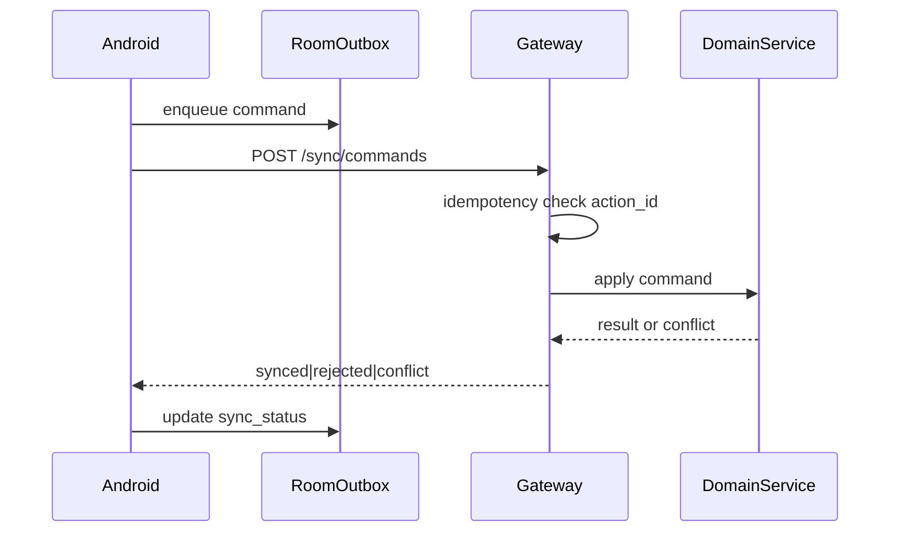

# Offline Sync Strategy

## Goals

- Android remains useful during temporary connectivity loss
- Low-risk operations queue locally; sensitive operations require online confirmation
- Backend processes commands idempotently — retries never duplicate money, repairs, or stock movements

## Local stack

- SQLite via Room
- Outbox table for pending commands
- WorkManager for background sync
- EncryptedSharedPreferences / DataStore for tokens

## Command envelope

```json
{
  "action_id": "uuid",
  "tenant_id": "uuid",
  "branch_id": "uuid",
  "device_id": "uuid",
  "user_id": "uuid",
  "command_type": "repair.create_draft",
  "local_timestamp": "ISO-8601",
  "payload": {},
  "sync_status": "pending|syncing|synced|rejected|conflict",
  "retry_count": 0,
  "last_error": null
}
```

## Allowed offline (low risk)

- Draft customer
- Draft repair job
- Device photos (upload when online)
- Technician notes / diagnosis / progress updates
- Draft part request
- Provisional cash receipt (status `provisional` until confirmed)

## Require online

- M-Pesa confirmation
- Refunds
- Supplier debt settlement
- Inventory adjustment approval
- Cash handover completion
- Completed sale reversal
- Repair price changes after approval
- Device collection authorization
- Stock transfer completion
- Manager approvals
- Supplier part collection confirmation (auth code redeem) — preferred online

## Sync flow



## Conflict resolution

| Domain | Strategy |
|--------|----------|
| Draft text/notes | Merge if non-overlapping fields; else server wins with client notified |
| Status transitions | Server state machine; invalid transition → reject |
| Inventory qty | **Never LWW**; reject and require refresh/approval |
| Payments / cash | **Never LWW**; reject duplicates via action_id |
| Assignments | Server wins; notify technician |

## Idempotency

- Primary key: `(tenant_id, action_id)`
- Same command body → same result
- Same action_id different body → `409 IDEMPOTENCY_PAYLOAD_MISMATCH`

## Photos

- Store locally; upload to R2 via pre-signed URL when online; attach keys to job

## UX states

- Offline badge, pending sync count, per-record sync status, conflict resolution screens for manager/tech

## Related

- [security-model.md](security-model.md)
- [testing-strategy.md](testing-strategy.md)
